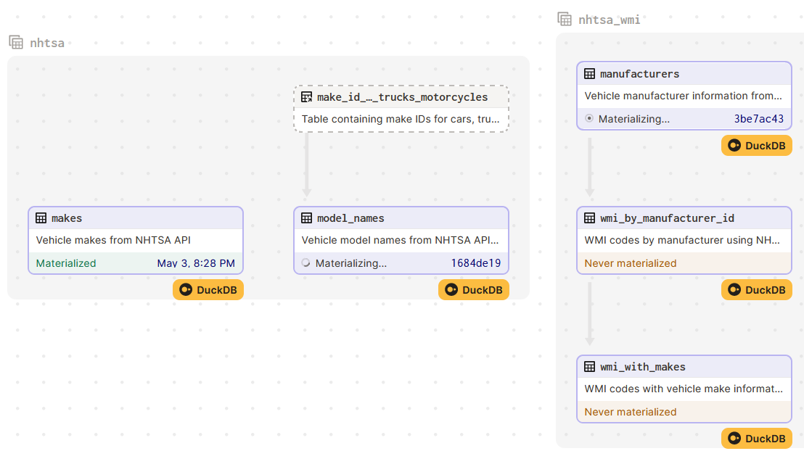

## NHTSA vPIC API Extract using python and dagster orchestration framework


### BACKGROUND
NHTSA (National Highway Transportation and Safety Administration) is a U.S. government agency responsible for tracking
vehicle safety.  As a consequence of this responsibility, vehicle manufacturers are required by law to provide vehicle
information to NHTSA.  This information includes basic VIN decode information.  In other words, for a given VIN or VIN
pattern, vehicle manufacturers must provide at minimum some basic vehicle information, such as model year, make, model,
manufacturer, etc.

NHTSA provides a free API service called "vPIC".  Information about its vPIC api can be accessed [here](https://vpic.nhtsa.dot.gov/api/).

With data extracted from NHTSA's vPIC api, we can create useful reference tables containing various vehicle information.

For example, we can obtain information about all the applicable model names under a given vehicle make.  We can also
find out which model years did a certain model was in existence.

### PURPOSE
The purpose of this code repository is to be able to extract information from NHTSA's vPIC api using python scripting.
The implementation contained in this repository saves the data as Snowflake tables.  However, we can choose to use a
different database if desired.
<br><br><br>

#### Why use an orchestration framework
The implementation contained in this repository uses a Python orchestration library called [dagster](https://docs.dagster.io/).  Using an
orchestration library is recommended especially if your tasks need to be repeated or scheduled.  There are other
reasons for using various orchestration libraries as they each have their own set of features.  One nice feature that
comes with dagster is it shows you what is known as data lineage - a way for you to visually see the dependencies of
your data assets.  It also shows you when each data asset was last materialized or created.  Dagster also comes with
various [integrations](https://docs.dagster.io/integrations) or plug-ins for working with Snowflake, Big Query, PySpark, pandas, dbt, Fivetran, etc. Another nice feature with dagster, it is very "local development friendly".  What this means is,
to use dagster, you aren't required or forced to develop using web-based or cloud-based tools or have to connect to a 
remote computer.  You can simply develop using your local Python development installed on your machine.  Dagster is even 
Windows OS friendly, unlike other orchestration frameworks that require you to use Linux/Mac OS or WSL2 or complex docker setup.


#### Getting started with dagster
Before getting started with dagster, it is highly recommended you view this short 26-minute YouTube [video](https://youtu.be/sCUYBa-glh0).  It should
give you a good sense of what dagster does and why such library can be useful.  Anyone with intermediate level of Python
experience should be able to follow the example.

- [Blog](https://dagster.io/blog/dagster-script-to-assets)
- [Code example](https://github.com/petehunt/dagster-script-to-assets)
- Official dagster [documentation](https://docs.dagster.io/getting-started) where you can find their [tutorial](https://docs.dagster.io/tutorial).


#### Installing a Python virtual environment (Windows 10)
It is highly recommended that you install what is known as a Python virtual environment using the built-in "venv" module.
After you have installed Python, you can issue the following command to create a virtual environment called "dagster_dev"
or whatever you want to call yours:
`python -m venv dagster_dev`


Then change directory into the newly created `dagster_dev` folder: `cd dagster_dev`


Then when you're within the `dagster_dev` folder, you can then activate it, by issuing the following command if using
Windows terminal:
`Scripts\activate.bat`

Then you can install dagster related packages using the `pip` command:
`pip install dagster dagit`

In this code repo, the actual packages that I installed are the following:

`pip install dagster dagit dagster-snowflake dagster-snowflake-pandas requests tqdm pylint black pytest loguru`

I then created my `requirements.txt` file by issuing the following command:

`pip freeze > requirements.txt`

This special file contains all the Python packages that I've installed in this code repository.  If you wanted to duplicate
my Python environment, you can simply import this `requirements.txt` file (NOTE: this particular environment would only be valid if you're on Windows 10)


#### Configuring Dagster for non-PROD with default sqlite backend
Before we can use dagster, we need to first create a `DAGSTER_HOME` environment variable that is set to the path 
containing your `dagster.yaml` file.


For instance, if your `dagster.yaml` file is located at: `C:\Users\your_user\.dagster\dagster.yaml`, then you can set
or create a new `DAGSTER_HOME` environment variable via `set` command:
`set DAGSTER_HOME=C:\Users\your_user\.dagster`


or the `export` command if you're not on Windows OS:
`export DAGSTER_HOME=/home/your_user/.dagster`


This special file is where you configure your dagster instance.  For information on all the things you can configure with
your local dagster instance, view this [page](https://docs.dagster.io/deployment/dagster-instance).  For just starting
off with local sqlite backend, your `dagster.yaml` file can just contain the following lines:
```
telemetry:
  enabled: false
```


What does this sqlite backend do?  It just stores runtime information when dagster executes your tasks or pipelines.
Information such as when the runs started, when they failed, how long they took to finish, etc.  You can also choose to
use a more robust database backend, such as PostgreSQL.


#### Creating / Setting up the nhtsa.duckdb database
Navigate to folder where you want to create your `nhtsa.duckdb` database.  Also save the `nhtsa_make_id.csv` file that came with this repo's `data/` folder to that same folder location where your `nhtsa.duckdb` file will be also.  Then using the duckdb CLI executable, create nhtsa.duckdb database via command: <br>
`duckdb nhtsa.duckdb`


Then create a new empty table that we will load the `nhtsa_make_id.csv` file into: <br>
`create table main.make_id_cars_trucks_motorcycles(make_id integer, make_name varchar(50));`


Then load/copy the `nhtsa_make_id.csv` file into that table: <br>
`copy main.make_id_cars_trucks_motorcycles from 'nhtsa_make_id.csv' (AUTO_DETECT TRUE)`


Finally, create `DUCKDB_DB_PATH` environment variable: <br>
`export DUCKDB_DB_PATH=/path/to/folder/containing/your/nhtsa.duckdb`   (Linux/MacOS) <br>


`set DUCKDB_DB_PATH=/path/to/folder/containing/your/nhtsa.duckdb`   (Windows) <br>


#### Running dagster and it's web UI called dagit
Assuming you have Python installed and your virtual environment activated, you can execute or run dagster's `dagit` web 
UI by changing directory into the `src` directory and then issuing the following command:


`dagster dev -f nhtsa_assets.py`


#### What your dagster assets should look like
When using the code in this repo and have dagster's `dagit` web UI up and running, you should have an asset lineage
graph that looks similar to below:





#### To-Do
- [X] Schedule asset materializations
- [ ] Add data validation perhaps using pydantic, add tests
- [ ] Dockerize it
